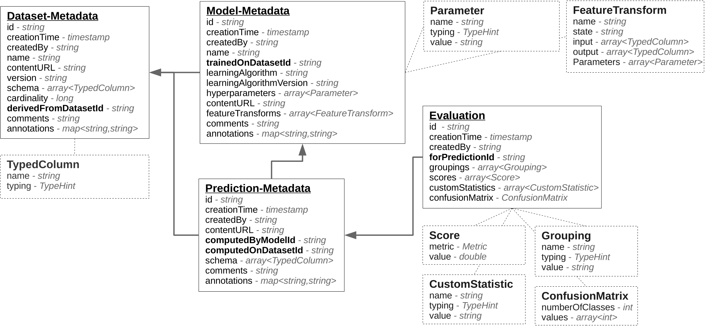

# Declarative Management of Machine Learning Experimentation Data

Currently, most ML workloads are executed in an “one-shot” and “ad-hoc” style via a variety of scripts, lacking declarative specifications and lacking storage of a declarative description of the executed workload.
Therefore, the execution of such tasks typically does not make use of historical data about related experiments and thereby lacks optimization potential and fails to achieve comparability and reproducibility.
To tackle this challenge, we propose the creation of a repository of declarative descriptions of machine learning experiments and their corresponding evaluation data. 
This will enable meta learning on this repository, e.g., to use the historical data to recommend features for new datasets, to find starting configurations for hyperparameter search, or to automatically compute baseline predictions for new tasks on existing datasets. 
Furthermore, we can also leverage the historical data to optimize the execution of new ML tasks, e.g. by re-using previously materialized intermediate results.

The envisioned system consists of three major components:
- a “repository for experimentation data”, which mostly comprises of model metadata and evaluation data from experiments, similar to [3]
- a “model parallel training and evaluation component”, which can compute evaluations for declaratively specified model configurations and store the resulting evaluations in the repository
- a “configuration selection” component that proposes promising model configurations, using established ML techniques, database-style optimizations and meta learning approaches based on the historical data in the repository

The benefit from such system is two-fold; incremental pipelines and warm starting pipeline training on new datasets.

## Experiment Database Schema

## Overview
We define two dimensions for the research direction; use case and improvement.
Table below shows dimensions and where related work stand.

|	      | Recommendation | Incremental Processing   | Continuous Deployment |
|:-------:|:--------------:|:------------------------:|:---------------------:|
|Quality  |      [1]       |           X              |           X           |
|Time     |      [1]       |		   X		      |			  X		      |

### Use Case Types
The experiment database can be used in three different use cases; recommendation (auto learning), continuous deployment, and incremental processing of pipelines.

#### Recommendation (and Auto Learning)
Recommending pipeline configurations or auto learning is a field of machine learning that tackles the problem of automatically solving machine learning problems.
Typically, experiment databases are analyzed to find patterns (meta-learning) and based on these patterns, recommendations can be made to create pipelines on new datasets.
This use case is the subject of on going research in machine learning community.
However, combined with incremental processing use case, there are some open problems that we can investigate.

#### Incremental Processing 
Perhaps the most common use case in the industry is the incremental processing of pipelines.
Users create an initial pipeline on an existing dataset.
The pipeline results in a model that is used for providing predictions.
Data is continuously collected from different sources and processed periodically (hourly, daily , ...) by the same pipeline to update the existing model.
By using the data in the experiment databases, we are able to keep the parameters of the pipeline updated and as a result provide higher quality data transformations.
More complex transformations such as dimensionality reduction benefit greatly from the experiment database as recomputing their statistics is very costly.
Moreover, in certain scenarios, due to changes in distribution of the incoming data, the same pipeline configuration is not useful anymore.
Spam detection and Online Ads recommendation are two of the common use cases were changes in the data should be reflected in the pipeline as well.
In these cases, experiment database is useful as it enables us to search the history to find similar patterns.
Once these patterns are recognized, suitable pipeline configurations can be used to further process the incoming data.

#### Continuous Deployment 
Continuous deployment can be viewed as a special case of incremental processing.
Once a model is trained, it is deployed into an environment where it will answer prediction queries.
A deployment system will monitor this model in real-time and train the model further based on the incoming training data.
Similar to incremental processing use case, new training observations are fed through the same pipeline that created the initial model.
Therefore, by using the experiment database, we are able to use the latest statistics for the pipeline component.
Moreover, in case of changes in the distribution of the incoming data, the experiment database can be analyzed to find the most suitable pipeline configuration.

### Improvement Types
Exploiting the experiment databases could result in both training of better machine learning models and reduced human latency as well as execution time.

#### Improvement in prediction quality
When encountered with new datasets and new machine learning tasks, users have limited budget to explore all the available options to create a pipeline.
As a result, the search for the pipeline that provides the highest prediction quality ends before the desired pipeline is reached.
By exploiting the information in the experiment database, the search space can be drastically reduced, allowing the users to focus on more promising configurations for their pipeline.
As a result, the chance of attaining a pipeline that provides a better model is increased.
This has been the topic of many of the existing work in the machine learning community [1,2].

#### Improvement in time
Our main focus is on the improvements in time.
The obvious benefit of such database comes from the recommendations that it provides.
Users will spend less time examining all the available configurations for the task at hand and will use the recommended configuration to create a pipeline.
We propose two other improvements that will reduce both the human latency and execution time.

**Incremental processing of pipelines:** 
In the incremental processing of the data, the format of the newly available data is the same as the existing dataset.
As a result, the same set of transformations can be applied without much manual intervention.
However, many of these transformations have internal parameters that are dependent on the historical data.
By using the information from the experiment database, we avoid the reprocessing of the entire historical data and can directly apply the latest versions of the transformations to the new batch of data.

**Materialization of common transformations:**
By tracking the usage of the users of different datasets and transformations, we can materialized the more common transformations and as a result speed up the execution time of the pipeline.

## Plan
As stated in [Overview](#overview), our primary focus will be on time (user latency and execution time) for incremental learning.
Here's the list of initial tasks: 

- Prototype of the Experiment Database
- Start with classification datasets for UCI [4] and OpenML [2] and transformations and learning algorithms from scikit-learn [5]
- Investigate the possible optimizations that can be applied
- Design the initial experiments (Incremental Spam Filtering)

Having these done, we able to explore other directions.
At the moment, these are the secondary set of objectives that we can aim for as part of the same or subsequent publications.

- Applications of Experiment Database to Continuous Deployment
	- While the scientific contribution is similar to the incremental processing scenario, here we focus on different set of experiments
- Materialized views 
	- In multi-user environments, similar pipelines (or pipeline components) will be applied to the same set of datasets
	- By analyzing the behavior of users, we can cache the result of common transformations 

## Questions
1. Does 'incremental update of the pipeline components' have any novelty on its own?
2. What other database style optimizations are possible? I can only think of caching of dataset transformations.
3. One use case that I'm looking into is changes in the incoming data distribution. How likely is it that:
	- This change requires different pipeline configuration?
	- How can we use the experiment database to provide such pipeline configuration?

## Designing the Experiments

## Conclusion

## References
[1] Feurer, Matthias, et al. "Efficient and robust automated machine learning." Advances in Neural Information Processing Systems. 2015.

[2] Vanschoren, Joaquin, et al. "OpenML: networked science in machine learning." ACM SIGKDD Explorations Newsletter 15.2 (2014): 49-60.

[3] Vanschoren, Joaquin, et al. "Experiment databases: A new way to share, organize and learn from experiments." Machine Learning 87.2 (2012): 127-158.

[4] Lichman, M. (2013). UCI Machine Learning Repository [http://archive.ics.uci.edu/ml]. Irvine, CA: University of California, School of Information and Computer Science.

[5] Scikit-learn: Machine Learning in Python, Pedregosa et al., JMLR 12, pp. 2825-2830, 2011.